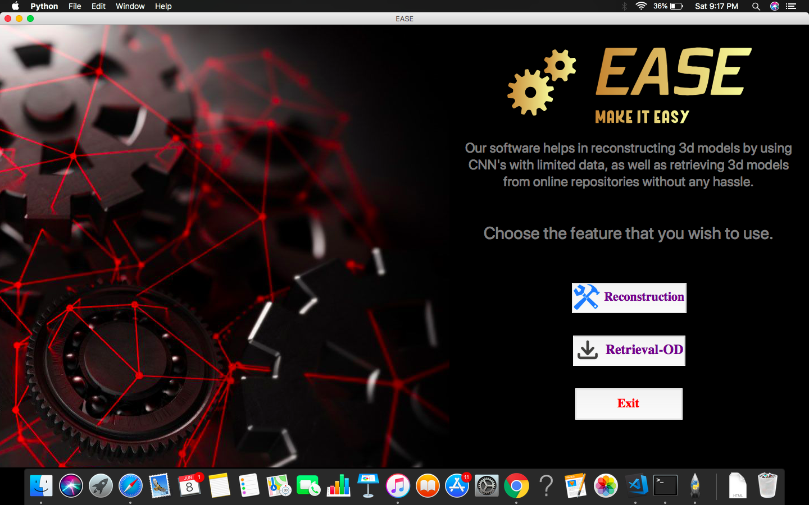

# EASE- Reconstruction and retrieval
A highly efficient software build for designers to reconstruct 3D mesh from an unlabelled, unordered set of images. It also has an additional feature of retrieving 3D meshes from online databases.


# Aim

To build a software which provides an extremely convenient way for designers to recreate or retrieve 3D models as per their wish.

## Background

This project was envisioned to reduce the complexity in the workflow of a designer. It is supposed to be a one-stop solution for Graphic designers, Part designers, etc. for all their needs in 3D meshes.

## Getting Started

Clone the repository in your system and follow these steps-
1. Check if the requirements are satisfied.

2. (You may skip this step as the download would automatically start in case you don't mannually download) Download the weights from the link https://drive.google.com/file/d/1f8_6yUAyuJlprSqE8yPGdAi9acN6Rod2/view?usp=sharing and copy them in output/ResidualGRUNet/default_model. The recreation module is an extensive network of 3D CNN followed by flattening and 2D CNN trained on ShapeNet database. As this a heavy network it is advised to download the pre-trained model’s weights.

3. Run the program inter.py.

4. Enjoy your results.

# Interface



## Interface for Reconstruction


## Interface for Retrieval


## Approach

Reconstruction module uses extensive Convolutional neural network to extract the features which will be decisive in firing up the voxel neurons. From an unordered set of images of the object (without background), it will be able to output the 3D mesh of the object to a fair degree of accuracy. We had built 2 modules, one for Reconstructing from unordered, unlabelled set of images to a 32*32 voxel size 3D mesh, and another module is retrieval from API of Google Poly database of the 3D mesh according to your search query. The first module uses Theano and sklearn framework for neural network architecture and working. The input channel is the 3 images of size 127*127*3 and output layer is 32*32 to detect voxel. Result samples can be checked out.

### Requirements

1.SciPy 

2.Numpy 

3.Imageio 

4.Open-cv

5.Tensorflow

6.Theano>=0.8

7.EasyDict

8.Pillow

9.pyyaml

10.sklearn


Note- Most of these can be easily installed via pip

```
pip install scipy
pip install numpy
pip install tensorflow
pip install imageio
pip install keras
```

### Installing

Clone the repository in your system and follow these steps-
1. Follow getting started.

## Running the tests

The interface is quite intuitive to master.


## Contributing

Janhavi Subedarpage
## Authors

* **Arth Dubey** 
